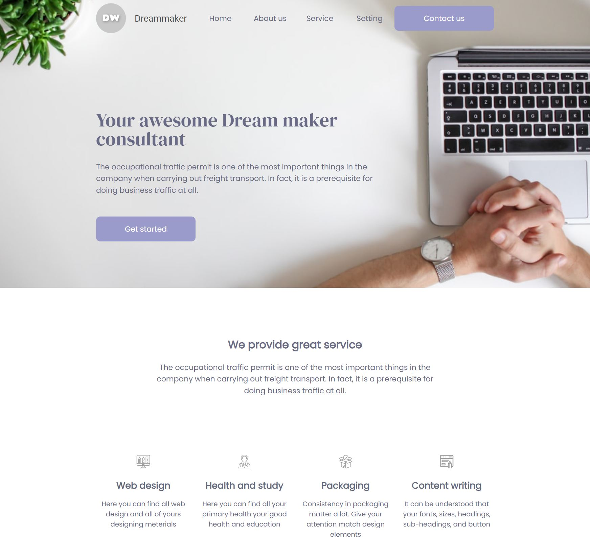

# Consultant Landing Page


## Demo

https://consultant-landing-pag.netlify.app




## Table of Contents
* [Demo](#demo)
* [General info](#general-info)
* [Features](#features)
* [Requirements](#requirements)
* [Setup](#setup)

## General info

This is an example of responsive landing page with some interacion between mock api, javascript and styles. The screen sizes used to this exercise are max-width 1440px and a mobile size of 360px. To develop this web page I have studied some components like **accordion**, **slideshow** and I have realized a fake **login**.

## Features

* Demo project files to be used as a reference building of:
  * *JavaScript*
  * *SASS / PostCSS*
  * *HTML* templates
  * *Images* (*CSS backgrounds and image tags*)
  * *Fonts*
* Latest [Webpack 5](https://github.com/webpack/webpack) - *JavaScript* module bundler. 
* Latest [SASS/PostCSS](https://github.com/sass/sass) compiler based on Dart `sass`.
* Latest [Babel 7](https://github.com/babel/babel) (`@babel/core`) - JavaScript compiler - _Use next generation JavaScript, today._
* Configured and ready to use **Webpack Dev Server** plugin for faster local development - [`webpack-dev-server`](https://webpack.js.org/configuration/dev-server/)

## Requirements

* `node` : `^10 || ^12 || >=14`
* `npm`

## Setup


``` bash
# install dependencies
npm install

# build for development
npm run build

# run the project
npm run start
```


